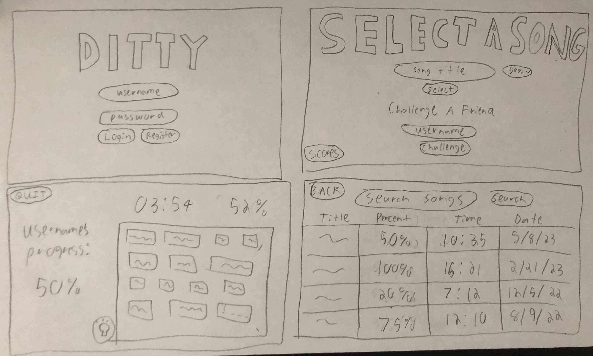

# Startup

[Notes](Notes/notes.md)

## Description deliverable

### Elevator pitch
Have you ever wanted to test how well you know a song's lyrics or see which one of your friends knows a song the best? The Ditty application lets you race against the clock and against your friends to see how fast you can type out a song's lyrics. You can race your friends in real time and can even see your past scores. You will be able to pick any song and what percentage of the song you want to type. 

### Design

### Key features
- Secure login over HTTPS
- Ability to search for song to select
- Ability to race friends in real time
- Displays current percentage of song typed
- Scores are persistently stored
- Ability to request a hint when user is stuck

### Technologies
I am going to use the required technologies in the following ways.
- **HTML** - Uses correct HTML structure for application. Four HTML pages. One for login, song selection, game play, and to see past scores. Hyperlinks to choice artifact.
- **CSS** - Application styling that looks good on different screen sizes, uses good whitespace, color choice and contrast.
- **JavaScript** - Provides login, choice of song display, real time status of typed lyrics for both the user and the friend.
- **Service** - Backend service with endpoints for:
    - login
    - retrieving lyrics
    - updating lyric progress
    - retrieving lyric progress
    - updating new scores
    - retrieving old scores
- **DB** - Stores users, lyrics, user's lyrics progress, and scores in database. 
- **Login** - Register and login users. Credentials securely stored in database. Can't play or see scores until authenticated. 
- **WebSocket**
    - Each user is updated with the other user's current progress.
    - Makes a call to a the *Genuis API* to get song lyrics.
- **React** - Application ported to use the React web framework.

## HTML Deliverable
- **HTML Pages** - Four HTML pages that represent the ability to login, select a song, play, and see past scores.
- **Links** - The pages have links to each other and there is a link at the bottom for GitHub.
- **Text** - All of the headings are text.
- **Images** - The GitHub link at the bottom is represented by a GitHub image.
- **Login** - There are input boxes for login. 
- **Database** - The svg represents where the lyrics will be pulled from the database and displayed.
- **Websocket** - The friend's percentage represents where the friend's real time data will be displayed.
